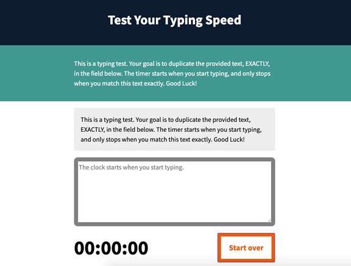

# Project: Typing Speed Tester

This project comes from the JavaScript Exxential Training course on Lynda, completed via [LinkedIn Learning](https://www.linkedin.com/learning/javascript-essential-training-3?pathUrn=urn%3Ali%3AlyndaLearningPath%3A59370541498ec352a683231c) by Morten Rand-Hendriksen on 4/1/2019.

## Getting Started

This project it covered in Section 8, Project: Typing Speed Tester. There are 7 subsections.

### Objectives

- [_] Add leading zero to numbers 9 or below (purely for aesthetics).

- [_] Run a standard minute/second/hundredths timer.

- [_] Match the text entered with the provided text on the page.

- [_] Start the timer.

- [_] Reset everything.

- [_] Add event listeners for keyboard input and the reset.

## Dive Deeper

Listed below are items for further exploration.

- [_] Add a words per minute count. You can find the calculation for it online, and you can just grab the time that you calculated, and combine it with the number of words in your test, and then you can figure out exactly how fast you're typing.

- [_] Count the number of errors the person doing the test makes because every time an error is triggered you can just increment a number and then it can display the number of errors.

- [_] Add an array of different texts so the tester can switch between different texts to test or even add a high score board (advanced option).
